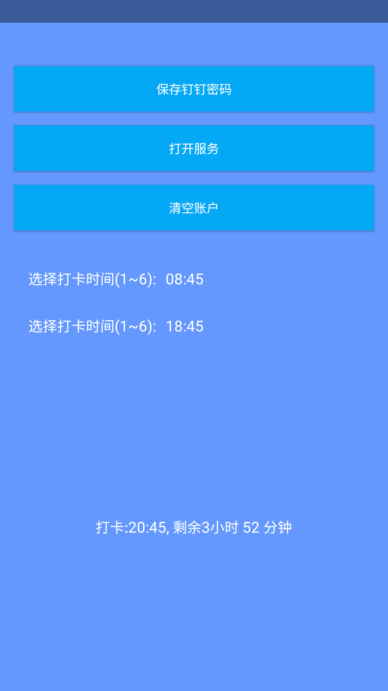
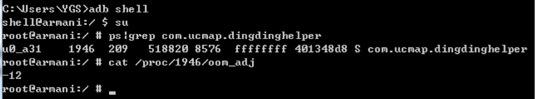

## <center/>钉钉打卡神器
>### 前言
>我是深圳一名白天上班,晚上修行学习的苦行憎.移动端不在像以前那么红,市场的招聘更是冷冷清清,公司也因此福利大减, 比如双休改为大小周,拼命的加班 反而请假无法调休,忘记打卡申报无效,等等更多不可理解的行为,于是钉钉打卡神器诞生了(现在每天都帮我自动打卡).





#### 使用
	需要root,把apk安装到system/app 目录下, 然后打开app, 保存下钉钉密码, 然后选择打卡时间,
	完成, 就是这么简单. AccessibilityService可以不打开, 打卡时间一到会自动打卡.


##### 钉钉打卡方式
1. 极速打卡,在办公地方自动打卡.
2. 手动进入考勤,定位打卡.

#### 大体思路
作为Android开发人士,相信手上都有不少工程机,利用遗留在公司的工程机,在打卡时间,自动解锁,启动钉钉,登录打卡退出锁屏.

#### 技术
* 四大组件
* AccessibilityService
* adb命令
* 多进程
* 进程保活

#### 思路解析
我相信很多人都利用过AccessibilityService来写自动抢红包,或者流氓安装,模拟点击, 但是AccessibilityService面对WebView却无能为力,不幸的是,钉钉的打卡页面恰恰是WebView.

1. 利用AlarmManager,注册静态广播(打卡时间回调)

	AlarmManager注册定时器广播, 打卡时间一到, 系统回调我们写好的静态广播,然后把DingDingHelperAccessibilityService,钉钉启动.
	
	```
	
	am.setWindow //把打卡时间转成Calendar,传进入
	
	```
	
	```
	//
	public class TimingBroadcastReceiver extends BroadcastReceiver {
    @Override
    public void onReceive(Context context, Intent intent) {

        Log.i("Infoss", "TimingBroadcastReceiver  已经被系统回调");
        //唤醒屏幕,解锁
        mList.add("input keyevent 26");
        /*从下往上滑动解锁*/
        mList.add("input swipe 200 800 200 100");
        //把 DingDingHelperAccessibilityService 唤醒 , 并且把钉钉启动
        命令settings put secure enabled_accessibility_services ...//启动DingDingHelperAccessibilityService
        接着 am start ...启动钉钉
        
        //接下来逻辑交给 DingDingHelperAccessibilityService , 完成打卡并退出.
        ...//省略N多逻辑
       }
    }

	```
	
	
2. DingDingHelperAccessibilityService 监听并处理钉钉窗口等.

	通过下面的代码可以监听到钉钉的窗口的变化,然后模拟点击,把保存好的密码,输入进去, 自动登录,进入打卡界面, 遍历所有节点找到上班打卡节点的AccessibilityNodeInfo, 然后算出打卡的x,y坐标, 通过命令模拟物理点击.
	
	```
	
	switch (eventType) {
            /*窗口变化*/
            case AccessibilityEvent.TYPE_WINDOW_CONTENT_CHANGED:
                windowContentChanged();
                break;
            //当通知栏发生改变时
            case AccessibilityEvent.TYPE_NOTIFICATION_STATE_CHANGED:
                notificationChanged(event);
                break;
            //当Activity等的状态发生改变时
            case AccessibilityEvent.TYPE_WINDOW_STATE_CHANGED:
                windowChanged(event);
                break;
        }
        
	```	
	
	
	```	
 	  AccessibilityNodeInfo mInfo = mNodeInfos;  //递归找到上班打卡的节点
 	  Rect mRect = new Rect();//构建rect
	  mInfo.getBoundsInScreen(mRect); //给rect赋值
 	  //命令执行物理点击 打卡
	  ShellUtils.execCmd("input tap " + mRect.centerX()+ " " + 	  mRect.centerY(),true)	
	```
	
3. 进程保活
	
	进程一旦被杀死 , 你写的广播也就不会回调 . 保持不死进程是很重要的一步 .
	
	(非root)网上各种保活套路层出不穷,相信除了手机QQ和微信(白名单), 还没有一个应用能很有效果的保活下来.系统要杀你,那轮到你不死.(孩子们太天真了).
	
	(root)有了这个权限就简单多了,跻身一变, 变成系统级别app.
	
	一键变身系统级别app 如下命令
	
	
	```
	mount -o rw,remount yassf2 /system/    //重新挂载
	chmod 777 /system/app/
	cp /data/app/com.ucmap.apt-2.apk   /system/app/com.ucmap.apt-2.apk  //复制app	到system/app/ 这个目录
	pm install -r \"/system/app/com.ucmap.apt-2.apk\" //安装	 am start -n \"com.ucmap.apt/om.ucmap.apt.MainActivity\" -a 	android.intent.action.MAIN -c android.intent.category.LAUNCHER"//启动app
	rm /data/app/com.ucmap.apt-2.apk  //删除原有的apk文件
	mount -o remount,ro -t yaffs2 /dev/block/mtdblock3 /system    //恢复分区
	```
	
	看下adj值
	
	
	
	adj值为-12,相当低了, 前台可见进程值0, 天王老子来也杀你不死

### 结束语
    安装上helper, 你基本可以开心玩耍 , 每天吃完早餐再去上班 , 不用急急忙忙冲上去打完卡在下来买早餐 ...
    最后我想说: 技术无错,看你怎么应用,还我快播啊.(客官们不要迟到啊!)
    
### 欢迎Fork,PR,Star!!  [钉钉自动打卡](https://github.com/Justson/DingDingHelper.git)   
 
	


